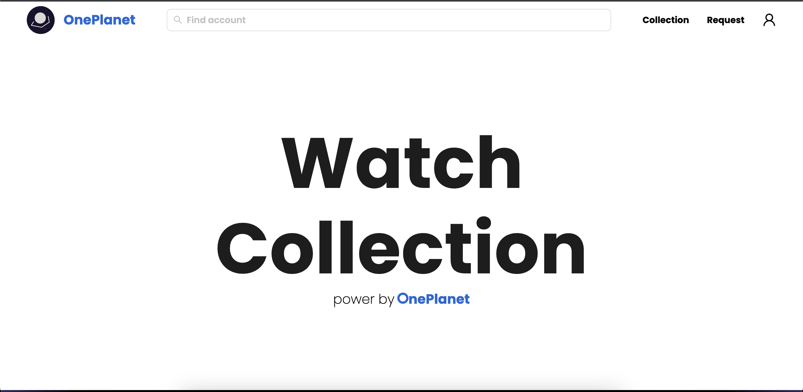

# One Planet Watch Collection



One Planet Watch Collection is a repository that showcases a collection of stunning watch designs inspired by the beauty and diversity of our planet. Each watch design represents a unique aspect of nature, such as landscapes, wildlife, or natural phenomena.

## Table of Contents

- [Features](#features)
- [Installation](#installation)
- [Running](#running)
- [Contributing](#contributing)
- [License](#license)

## Features

High-quality watch designs inspired by nature.
Unique and diverse collection of designs.
Detailed documentation for each watch design.
Easy installation and usage.

## Installation

To use the One Planet Watch Collection, follow these steps:

1. Clone this repository to your local machine using the following command:

```bash
git clone https://github.com/nutthanonn/one-planet-watch-collection.git
```

2. Navigate to the repository's directory:

```bash
cd one-planet-watch-collection
```

That's it! You're now ready to explore the collection of watch designs.

## Running

To run the One Planet Watch Collection, follow these steps:

1. Navigate to the repository's directory:

```bash
cd one-planet-watch-collection
```

2. Navigate to the server directory:

```bash
cd server
```

3. Running the server:

```bash
docker compose up -d
```

4. Navigate to the client directory:

```bash
cd client
```

5. Running the client:

```bash
docker compose up -d
```

6. Open your browser and navigate to the following URL:

```bash
http://localhost:3000
```

## Contributing

Contributions to the One Planet Watch Collection are welcome! If you would like to contribute to the repository, please follow these guidelines:

1. Fork the repository on GitHub.
2. Create a new branch with a descriptive name for your feature or bug fix.
3. Make your changes, including necessary documentation updates.
4. Test your changes to ensure they work as expected.
5. Commit your changes and push them to your forked repository.
6. Submit a pull request to the main repository.

Please ensure your contributions align with the repository's coding style and guidelines. Also, make sure to respect the licenses and intellectual property of any third-party resources used in your contributions.

## License

The One Planet Watch Collection is open-source software released under the MIT License. Feel free to use, modify, and distribute the watch designs in this repository in accordance with the license terms.
